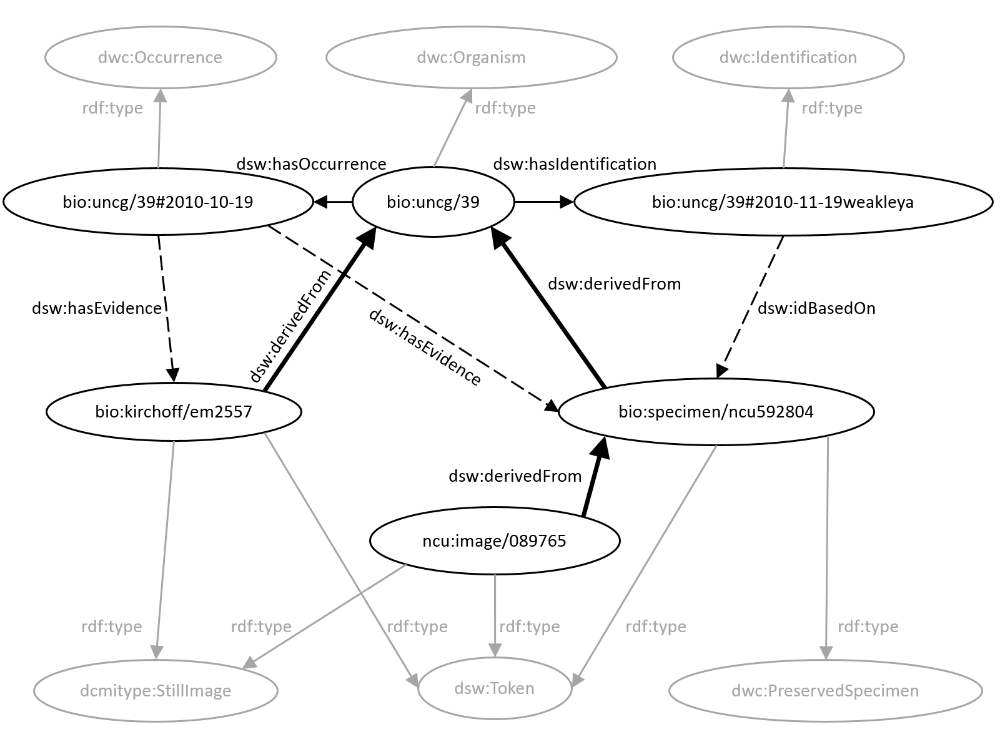

#Learning SPARQL Chapter 3 - part 2

Steve Baskauf 2015-11-02

## Background

To get to lodlive and start with the Bicentennial Oak:
[http://en.lodlive.it/?http://bioimages.vanderbilt.edu/vanderbilt/7-314](http://en.lodlive.it/?http://bioimages.vanderbilt.edu/vanderbilt/7-314)

Traverse the graph to Feature by: 

- dsw:hasOccurrence to http://bioimages.vanderbilt.edu/vanderbilt/7-314#2002-06-14
- dsw:atEvent
- dsw:locatedAt 
- dwciri:inDescribedPlace
- Then traverse the graph to the Identification via dsw:hasIdentification.


### Why is this graph more complicated than it seems like it needs to be?

For more on the Darwin-SW model that underlies this graph, see:
[http://www.semantic-web-journal.net/content/darwin-sw-darwin-core-based-terms-expressing-biodiversity-data-rdf-1](http://www.semantic-web-journal.net/content/darwin-sw-darwin-core-based-terms-expressing-biodiversity-data-rdf-1)

For more on the Darwin Core RDF Guide, see this in-press Semantic Web Journal article:
[http://www.semantic-web-journal.net/content/lessons-learned-adapting-darwin-core-vocabulary-standard-use-rdf](http://www.semantic-web-journal.net/content/lessons-learned-adapting-darwin-core-vocabulary-standard-use-rdf)

##Linking across the graph: challenge questions

[Go to the Heard Library SPARQL endpoint (rdf.library.vanderbilt.edu)](http://rdf.library.vanderbilt.edu/sparql?view)

1. Find things that occur at Vanderbilt University (click on the resulting URIs to see what they are).

2. Limit the things to Living Specimens (rdf:type dwc:LivingSpecimen; this will be trees in the Arboretum)
3. Give the common names for the things (remove LivingSpecimen requirement; dwc:vernacularName property of Identification).

4. Give common names and IRIs for things occurring in Beaman Park, Alaska, Canada.

5. Try filter for "Smoky Mountain".

6. Try filter for Catalan "Grans Muntanyes".  Note: str(?var) function strips off language tags.

7. Find pictures of bears and say what state they are in (note: states are 1st level administrative jurisdictions and coded as 
gn:featureCode gn:A.ADM1

8. Find pictures of bears that were photographed in parks, give the name of the species of bear, and find the DBpedia URI for the 
park (parks are gn:featureCode L.PRK and dbpedia URIs are linked via rdfs:seeAlso)

9. Query remote DBpedia endpoint to find properties/values of the referent of the Yellowstone IRI

10. Conduct a federated query to find the home page of "Yellowstone National Park"@en in DBpedia, and from Bioimages, all of the things that occurred there and their common names. 
11. (#FAIL) Conduct a federated query to find pictures of bears that were photographed in parks, give the name of the species 
of bear, find the homepage of the park, and the Spanish abstract about the park.  [Times out - asks too much across endpoints, I guess]

##If there is time...

### Power of Linked Data to make actual discoveries (things not apparent in a provider's own data)

Evidence graph from Darwin-SW paper:



Example in Section 3.3.2:

Expressed explicitly in RDF:
```
<http://herbarium.unc.edu/image/089765> dsw:derivedFrom <http://bioimages.vanderbilt.edu/specimen/ncu592804>.

<http://bioimages.vanderbilt.edu/specimen/ncu
592804> dsw:derivedFrom <http://bioimages.vanderbilt.edu/uncg/39>.
```

Entailed from transitivity of dsw:derivedFrom:
```
<http://herbarium.unc.edu/image/089765> dsw:derivedFrom <http://bioimages.vanderbilt.edu/uncg/39>.
```

Query using property paths to find all derived resources:
```
SELECT DISTINCT ?resource
WHERE {
 ?resource dsw:derivedFrom+ <http://bioimages.vanderbilt.edu/uncg/39>.
 }
```

### Datatyping problems
```
SELECT DISTINCT ?resource ?type
WHERE {
?resource dsw:derivedFrom
<http://bioimages.vanderbilt.edu/uncg/39>.
?resource a ?type.
?resource dcterms:created ?date.
FILTER(?date >= xsd:date("2000-01-01"))
}
```
1. Why does this not work?!  
Callimachus doesn't support xsd:date() function.

2. Does this work?

```
SELECT DISTINCT ?resource ?type
WHERE {
?resource dsw:derivedFrom
<http://bioimages.vanderbilt.edu/uncg/39>.
?resource a ?type.
?resource dcterms:created ?date.
FILTER(?date >= "2000-01-01"^^xsd:date)
}
```
Examine the actual creation date value given for
[http://bioimages.vanderbilt.edu/specimen/ncu592804.rdf](http://bioimages.vanderbilt.edu/specimen/ncu592804.rdf)
```
<http://bioimages.vanderbilt.edu/specimen/ncu592804> dcterms:created "2010-10-19".
```

Recall that the resource denoted by the plain literal "2010-10-19" (a text string) is not the same as the datatyped literal "2010-10-19"^^xsd:date which denotes an actual date as an abstract thing.

3. Try this:

```
SELECT DISTINCT ?resource ?type
WHERE {
?resource dsw:derivedFrom
<http://bioimages.vanderbilt.edu/uncg/39>.
?resource a ?type.
?resource dcterms:created ?date.
FILTER(?date >= "2000-01-01")
}
```
It's doing a simple string comparison without any understanding of calendars, time zones, etc.

Datatyped dates are awesome if you are willing to go to the trouble to be careful with them and annoying of you don't care.
