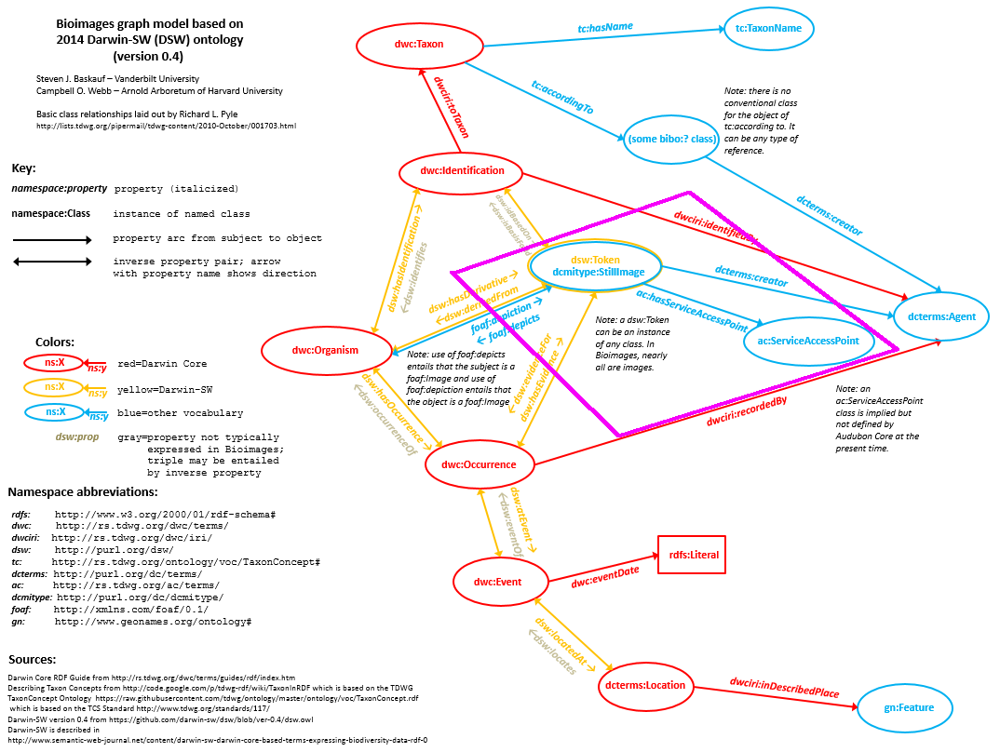
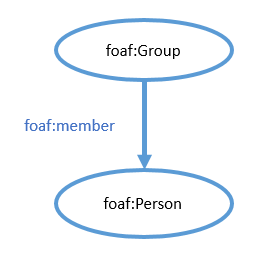
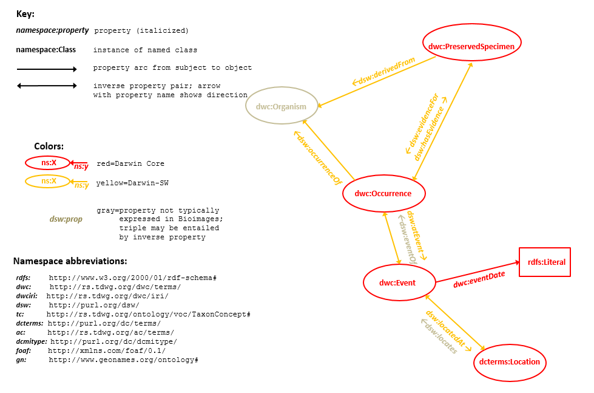
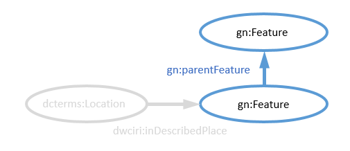

# Bioimages graph model
**Vanderbilt University Semantic Web Working Group**

[back to the User Guide](README.md)

[go to the SPARQL query interface](https://sparql.vanderbilt.edu/#query)

## Status

The Bioimages (http://bioimages.vanderbilt.edu) dataset is relatively mature and has been in production for a number of years.  The graph model is based on a published model ([http://dx.doi.org/10.3233/SW-150203](http://www.semantic-web-journal.net/content/darwin-sw-darwin-core-based-terms-expressing-biodiversity-data-rdf-1)) as well as [TDWG](http://www.tdwg.org/) international biodiversity informatics standards, so it can be considered relatively stable.  See [this page](http://bioimages.vanderbilt.edu/pages/standards.htm) for details.

The dataset currently loaded is the 2017-06-11 release (https://doi.org/10.5281/zenodo.806034).

See [this page](https://github.com/HeardLibrary/semantic-web/blob/master/learning-sparql/learning-sparql-ch3-part1-answers.md) for more examples of complex queries of Bioimages data.

## Named graphs in the triple store (URIs do not dereference)

### Organisms graph http://bioimages.vanderbilt.edu/organisms

This graph describes organisms, their identifications, and their occurrences (including time and location).

**Graph model:**


Organism-related resources described in this graph are outlined in violet.

**CURIEs (namespaces) used:**
```
PREFIX rdf: <http://www.w3.org/1999/02/22-rdf-syntax-ns#>
PREFIX rdfs: <http://www.w3.org/2000/01/rdf-schema#>
PREFIX dc: <http://purl.org/dc/elements/1.1/>
PREFIX dcterms: <http://purl.org/dc/terms/>
PREFIX dwc: <http://rs.tdwg.org/dwc/terms/>
PREFIX dwciri: <http://rs.tdwg.org/dwc/iri/>
PREFIX dsw: <http://purl.org/dsw/>
PREFIX tc: <http://rs.tdwg.org/ontology/voc/TaxonConcept#>
PREFIX geo: <http://www.w3.org/2003/01/geo/wgs84_pos#>
PREFIX foaf: <http://xmlns.com/foaf/0.1/>
PREFIX xmp: <http://ns.adobe.com/xap/1.0/>
PREFIX txn: <http://lod.taxonconcept.org/ontology/txn.owl#>
PREFIX blocal: <http://bioimages.vanderbilt.edu/rdf/local#>
```
**Sample queries:**

Find states where occurrences of bears (genus="*Ursus*") were documented and list the common name of the species:
```
PREFIX dwc: <http://rs.tdwg.org/dwc/terms/>
PREFIX dsw: <http://purl.org/dsw/>
SELECT DISTINCT ?commonName ?state
WHERE {
      ?ID dwc:genus "Ursus".
      ?ID dwc:vernacularName ?commonName.
      ?thing dsw:hasIdentification ?ID.
      ?thing dsw:hasOccurrence ?occur.
      ?occur dsw:atEvent ?event.
      ?event dsw:locatedAt ?loc.
      ?loc dwc:stateProvince ?state.
      }
```

Find organisms documented before 1970, and list their species and URIs.
```
PREFIX dwc: <http://rs.tdwg.org/dwc/terms/>
PREFIX dsw: <http://purl.org/dsw/>
SELECT DISTINCT ?species ?organism
WHERE {
      ?ID dwc:scientificName ?species.
      ?organism dsw:hasIdentification ?ID.
      ?organism dsw:hasOccurrence ?occur.
      ?occur dsw:atEvent ?event.
      ?event dwc:eventDate ?date.
      FILTER (?date < "1970"^^xsd:gYear)
      }
```

### Images graph http://bioimages.vanderbilt.edu/images

This graph describes images and their variants (thumbnails, web-quality images, original images, etc.) known as Service Access Points.

**Graph model:**


Image-related resources described in this graph are outlined in violet.

**CURIEs (namespaces) used:**
```
PREFIX rdf: <http://www.w3.org/1999/02/22-rdf-syntax-ns#>
PREFIX rdfs: <http://www.w3.org/2000/01/rdf-schema#>
PREFIX owl: <http://www.w3.org/2002/07/owl#>
PREFIX xsd: <http://www.w3.org/2001/XMLSchema#>
PREFIX xml: <http://www.w3.org/XML/1998/namespace>
PREFIX xhv: <http://www.w3.org/1999/xhtml/vocab#>
PREFIX dc: <http://purl.org/dc/elements/1.1/>
PREFIX dcterms: <http://purl.org/dc/terms/>
PREFIX ac: <http://rs.tdwg.org/ac/terms/>
PREFIX dwc: <http://rs.tdwg.org/dwc/terms/>
PREFIX dwciri: <http://rs.tdwg.org/dwc/iri/>
PREFIX dsw: <http://purl.org/dsw/>
PREFIX geo: <http://www.w3.org/2003/01/geo/wgs84_pos#>
PREFIX foaf: <http://xmlns.com/foaf/0.1/>
PREFIX cc: <http://creativecommons.org/ns#>
PREFIX Iptc4xmpExt: <http://iptc.org/std/Iptc4xmpExt/2008-02-29/>
PREFIX exif: <http://ns.adobe.com/exif/1.0/>
PREFIX xmp: <http://ns.adobe.com/xap/1.0/>
PREFIX xmpRights: <http://ns.adobe.com/xap/1.0/rights/>
PREFIX photoshop: <http://ns.adobe.com/photoshop/1.0/>
PREFIX mbank: <http://www.morphbank.net/schema/morphbank#>
PREFIX blocal: <http://bioimages.vanderbilt.edu/rdf/local#>
```

**Sample queries:**

Find images photographed by James Bassett (```<http://bioimages.vanderbilt.edu/contact/baskauf#bassettjh>```).  List the URIs of the organisms depicted and the URLs from which web-quality images can be downloaded:
```
PREFIX ac: <http://rs.tdwg.org/ac/terms/>
PREFIX dcterms: <http://purl.org/dc/terms/>
PREFIX foaf: <http://xmlns.com/foaf/0.1/>
SELECT DISTINCT ?organism ?URL
WHERE {
      ?image dcterms:creator <http://bioimages.vanderbilt.edu/contact/baskauf#bassettjh>.
      ?image foaf:depicts ?organism.
      ?image ac:hasServiceAccessPoint ?sap.
      ?sap ac:variant ac:LowerQuality.
      ?sap ac:accessURI ?URL.
      }
```

This query extends the query above into the organism graph. Find images taken by the Stream Team. List the taxonomy of the organism, dateTime taken, and the URLs from which high-quality images can be downloaded:
```
PREFIX ac: <http://rs.tdwg.org/ac/terms/>
PREFIX dcterms: <http://purl.org/dc/terms/>
PREFIX dwc: <http://rs.tdwg.org/dwc/terms/>
PREFIX dsw: <http://purl.org/dsw/>
PREFIX foaf: <http://xmlns.com/foaf/0.1/>
SELECT DISTINCT ?class ?order ?sciName ?time ?URL
WHERE {
      ?image dcterms:creator <http://bioimages.vanderbilt.edu/contact/streamteam>.
      ?image dcterms:created ?time.
      ?image foaf:depicts ?organism.
      ?organism dsw:hasIdentification ?ID.
      OPTIONAL {?ID dwc:scientificName ?sciName.}
      OPTIONAL {?ID dwc:order ?order.}
      OPTIONAL {?ID dwc:class ?class.}
      ?image ac:hasServiceAccessPoint ?sap.
      ?sap ac:variant ac:GoodQuality.
      ?sap ac:accessURI ?URL.
      }
ORDER BY ?time
```

### People graph http://bioimages.vanderbilt.edu/people

This graph describes agents in general, including people and groups of which they are members.

**Graph model:**


**CURIEs (namespaces) used:**
```
PREFIX rdf: <http://www.w3.org/1999/02/22-rdf-syntax-ns#>
PREFIX rdfs: <http://www.w3.org/2000/01/rdf-schema#>
PREFIX owl: <http://www.w3.org/2002/07/owl#>
PREFIX xsd: <http://www.w3.org/2001/XMLSchema#>
PREFIX xml: <http://www.w3.org/XML/1998/namespace>
PREFIX dc: <http://purl.org/dc/elements/1.1/>
PREFIX dcterms: <http://purl.org/dc/terms/>
PREFIX foaf: <http://xmlns.com/foaf/0.1/>
PREFIX xmp: <http://ns.adobe.com/xap/1.0/>
```
**Sample queries:**

List names of people who have created images and give their location:
```
PREFIX dcterms: <http://purl.org/dc/terms/>
PREFIX foaf: <http://xmlns.com/foaf/0.1/>
SELECT DISTINCT ?name ?location
WHERE {
      ?image a <http://purl.org/dc/dcmitype/StillImage>.
      ?image dcterms:creator ?person.
      ?person a foaf:Person.
      ?person foaf:name ?name.
      ?person foaf:family_name ?surname.
      ?person foaf:based_near ?location.
      }
ORDER BY ?surname
```

A better version of the previous query that does not require that the photographer be a person, have a surname, nor have a location:
```
PREFIX dcterms: <http://purl.org/dc/terms/>
PREFIX foaf: <http://xmlns.com/foaf/0.1/>
SELECT DISTINCT ?name ?class ?location
WHERE {
      ?image a <http://purl.org/dc/dcmitype/StillImage>.
      ?image dcterms:creator ?agent.
      ?agent foaf:name ?name.
      ?agent a ?class.
      OPTIONAL {?agent foaf:family_name ?surname.}
      OPTIONAL {?agent foaf:based_near ?location.}
      }
ORDER BY ?surname
```

This query uses the dwciri:identifiedBy property (see the organism graph model) to link people to identifications that they have made.  The results show the high-level taxonomy of the kinds of organisms they have identified:
```
PREFIX foaf: <http://xmlns.com/foaf/0.1/>
PREFIX dwciri: <http://rs.tdwg.org/dwc/iri/>
PREFIX dwc: <http://rs.tdwg.org/dwc/terms/>
SELECT DISTINCT ?name ?kingdom ?class
WHERE {
      ?person a foaf:Person.
      ?person foaf:name ?name.
      ?ID dwciri:identifiedBy ?person.
      ?ID dwc:kingdom ?kingdom.
      ?ID dwc:class ?class.
      }
ORDER BY ?name
```

### Specimens graph http://bioimages.vanderbilt.edu/specimens

Bioimages contains information about relatively few specimens.  They are generally secondary forms of evidence for occurrences documented in the database.

**Graph model:**


**CURIEs (namespaces) used:**
```
PREFIX rdf: <http://www.w3.org/1999/02/22-rdf-syntax-ns#>
PREFIX dc: <http://purl.org/dc/elements/1.1/>
PREFIX dcterms: <http://purl.org/dc/terms/>
PREFIX dwc: <http://rs.tdwg.org/dwc/terms/>
PREFIX dwciri: <http://rs.tdwg.org/dwc/iri/>
PREFIX dsw: <http://purl.org/dsw/>
PREFIX foaf: <http://xmlns.com/foaf/0.1/>
PREFIX geo: <http://www.w3.org/2003/01/geo/wgs84_pos#>
PREFIX xsd: <http://www.w3.org/2001/XMLSchema#>
```
**Sample queries:**

This query lists the collector, species, and locality of specimens:
```
PREFIX dwc: <http://rs.tdwg.org/dwc/terms/>
PREFIX dsw: <http://purl.org/dsw/>
SELECT DISTINCT ?species ?collector ?locality
WHERE {
      ?token a dwc:PreservedSpecimen.
      ?occurrence dsw:hasEvidence ?token.
      ?organism dsw:hasOccurrence ?occurrence.
      ?occurrence dwc:recordedBy ?collector.
      ?organism dsw:hasIdentification ?ID.
      ?ID dwc:scientificName ?species.
      ?occurrence dsw:atEvent ?event.
      ?event dsw:locatedAt ?location.
      ?location dwc:locality ?locality.
      }
ORDER BY ?species
```

This is a more complicated query that requires that an organism be documented by both a preserved specimen and an image. It then determines the species identification of that organism and lists the museum that contains the specimen and the identifier for the "cameo" image for the organism:
```
PREFIX dwc: <http://rs.tdwg.org/dwc/terms/>
PREFIX dsw: <http://purl.org/dsw/>
PREFIX blocal: <http://bioimages.vanderbilt.edu/rdf/local#>
PREFIX dc: <http://purl.org/dc/elements/1.1/>
SELECT DISTINCT ?species ?museum ?image
WHERE {
      ?token1 a dwc:PreservedSpecimen.
      ?occurrence1 dsw:hasEvidence ?token1.
      ?organism dsw:hasOccurrence ?occurrence1.
      ?organism dsw:hasOccurrence ?occurrence2.
      ?occurrence2 dsw:hasEvidence ?token2.
      ?token2 a <http://purl.org/dc/dcmitype/StillImage>.
      ?organism dsw:hasIdentification ?ID.
      ?ID dwc:scientificName ?species.
      ?organism blocal:cameo ?image.
      ?token1 dc:creator ?museum.
      }
```

### Places graph http://bioimages.vanderbilt.edu/places

Bioimages distinguishes between Locations (geographic points usually described by specific geocoordinates) and Places (described geographic features).  The places in this graph were extracted from GeoNames (http://www.geonames.org/) based on dwciri:inDescribedPlace links from organism locations.

**Graph model:**


**CURIEs (namespaces) used:**
```
PREFIX rdf: <http://www.w3.org/1999/02/22-rdf-syntax-ns#>
PREFIX rdfs: <http://www.w3.org/2000/01/rdf-schema#>
PREFIX xsd: <http://www.w3.org/2001/XMLSchema#>
PREFIX cc: <http://creativecommons.org/ns#>
PREFIX dcterms: <http://purl.org/dc/terms/>
PREFIX foaf: <http://xmlns.com/foaf/0.1/>
PREFIX gn: <http://www.geonames.org/ontology#>
PREFIX wgs84_pos: <http://www.w3.org/2003/01/geo/wgs84_pos#>
```

**Sample queries:**

Find the names of places associated with the location ```<http://bioimages.vanderbilt.edu/vanderbilt/7-314#2002-06-14loc>```:
```
PREFIX dwciri: <http://rs.tdwg.org/dwc/iri/>
PREFIX gn: <http://www.geonames.org/ontology#>
SELECT DISTINCT ?name
WHERE {
<http://bioimages.vanderbilt.edu/vanderbilt/7-314#2002-06-14loc> dwciri:inDescribedPlace ?place.
      ?place gn:name ?name.
      }
```

Find places that are two parentFeature links below the United States (```<http://sws.geonames.org/6252001/>```) and list the name and alternate name in Japanese (if available):
```
PREFIX gn: <http://www.geonames.org/ontology#>
SELECT DISTINCT ?name ?alternate
WHERE {
      ?place gn:parentFeature/gn:parentFeature <http://sws.geonames.org/6252001/>.
      ?place gn:name ?name.
      OPTIONAL {
               ?place gn:alternateName ?alternate.
               FILTER (lang(?alternate)="ja")
               }
      }
```


### http://bioimages.vanderbilt.edu/vocabs

This graph contains several vocabularies referenced in the RDF:

**Darwin-SW** (http://purl.org/dsw/) Described at: https://github.com/darwin-sw/dsw

**Standardized organism views** (http://bioimages.vanderbilt.edu/rdf/stdview) Described at: http://bioimages.vanderbilt.edu/pages/std-views.htm and http://www.cals.ncsu.edu/plantbiology/ncsc/vulpia/pdf/Baskauf_&_Kirchoff_Digital_Plant_Images.pdf (published paper) and http://baskauf.blogspot.com/2016/03/controlled-values-for-subject-category.html (blog post)

**Bioimages local properties**: (http://bioimages.vanderbilt.edu/rdf/local)

[back to the User Guide](README.md)

[go to the SPARQL query interface](https://sparql.vanderbilt.edu/#query)
