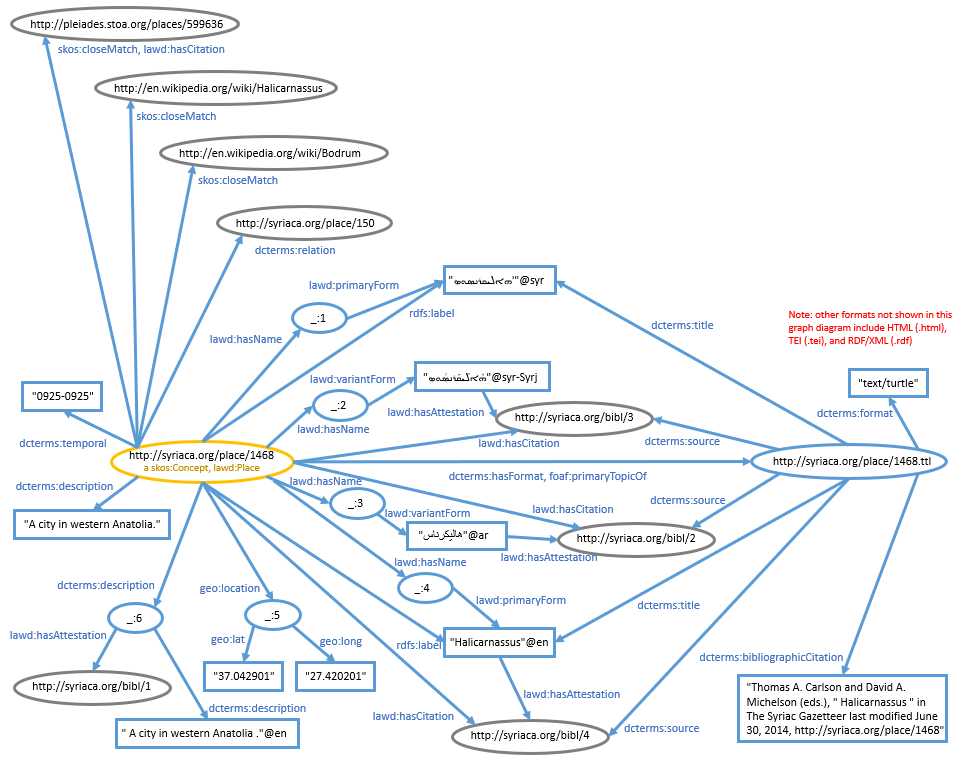

# Syriac Gazetteer graph model
**Vanderbilt University Semantic Web Working Group**

[back to the User Guide](README.md)

[go to the SPARQL query interface](https://sparql.vanderbilt.edu/#query)

## Status

The Syriac Gazetteer (http://syriaca.org/geo/index.html) is a geographical reference work of [Syriaca.org](http://syriaca.org/) for places relevant to Syriac studies. For detailed information about the dataset and other mechanisms for accessing the data, visit [The Syriac Gazetter help page](http://syriaca.org/geo/help/index.html).  

The data loaded in this triplestore originated from [Syriaca.org: The Syriac Reference Portal](https://github.com/srophe) on Github. The data were loaded from https://raw.githubusercontent.com/srophe/srophe-data-rdf/master/rdf/srophe/places-pelagios.rdf, are Copyright 2014 Vanderbilt University, Princeton University, and the Contributor(s), and are licensed under a [Creative Commons Attribution 3.0 Unported License](http://creativecommons.org/licenses/by/3.0/).

Citation: The Syriac Gazetteer, edited by Thomas A. Carlson and David A. Michelson. *Forthcoming from* Syriaca.org: The Syriac Reference Portal, edited by David A. Michelson. http://syriaca.org/geo.

## Named graphs in the triple store (URIs do not dereference)

### Place concepts http://syriaca.org/place

This graph describes places, their names, locations, and the sources from which the data were derived.

**Graph model:**


The primary described resource is outlined in yellow. Other resources described in this graph are outlined in blue.  Linked resources described outside this graph are outlined in gray.

Note: although many of the triples shown in this graph are actually represented in the graph, a few are made up to illustrate relationships expressed for other resources in the dataset.

**CURIEs (namespaces) used:**
```
PREFIX rdf: <http://www.w3.org/1999/02/22-rdf-syntax-ns#>
PREFIX rdfs: <http://www.w3.org/2000/01/rdf-schema#>
PREFIX dcterms: <http://purl.org/dc/terms/>
PREFIX geo: <http://www.w3.org/2003/01/geo/wgs84_pos#>
PREFIX foaf: <http://xmlns.com/foaf/0.1/>
PREFIX skos: <http://www.w3.org/2004/02/skos/core#>
PREFIX lawd: <http://lawd.info/ontology/>
```
**Sample queries:**

Find place name labels in English, Syriac, and Arabic:
```
PREFIX lawd: <http://lawd.info/ontology/>
SELECT DISTINCT ?place ?english ?syriac ?arabic
FROM <http://syriaca.org/place>
WHERE {
  ?place a lawd:Place.
  OPTIONAL {
    ?place lawd:hasName/lawd:variantForm ?english.
    FILTER (langMatches(lang(?english),"en" ))
    }
  OPTIONAL {
    ?place lawd:hasName/lawd:variantForm ?syriac.
    FILTER (langMatches(lang(?syriac),"syr" ))
    }
  OPTIONAL {
    ?place lawd:hasName/lawd:variantForm ?arabic.
    FILTER (langMatches(lang(?arabic),"ar" ))
    }
  }
limit 100
```

[back to the User Guide](README.md)

[go to the SPARQL query interface](https://sparql.vanderbilt.edu/#query)
