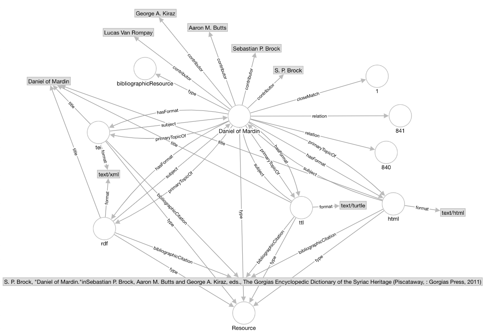

# Syriac Gazetteer graph model
**Vanderbilt University Linked Data Working Group**

[back to the User Guide](README.md)

[go to the SPARQL query interface](https://sparql.vanderbilt.edu/#query)

## Status

The Syriac Gazetteer (http://syriaca.org/geo/index.html) is a geographical reference work of [Syriaca.org](http://syriaca.org/) for places relevant to Syriac studies. For detailed information about the dataset and other mechanisms for accessing the data, visit [The Syriac Gazetter help page](http://syriaca.org/geo/help/index.html).  

The data loaded in this triplestore originated from [Syriaca.org: The Syriac Reference Portal](https://github.com/srophe) on Github. The data were loaded from https://raw.githubusercontent.com/srophe/srophe-data-rdf/master/rdf/srophe/places-pelagios.rdf, are Copyright 2014 Vanderbilt University, Princeton University, and the Contributor(s), and are licensed under a [Creative Commons Attribution 3.0 Unported License](http://creativecommons.org/licenses/by/3.0/).

Citation: The Syriac Gazetteer, edited by Thomas A. Carlson and David A. Michelson. *Forthcoming from* Syriaca.org: The Syriac Reference Portal, edited by David A. Michelson. http://syriaca.org/geo.

## Named graphs in the triple store (URIs do not dereference)

### Place concepts http://syriaca.org/place

This graph describes places, their names, locations, and the sources from which the data were derived.

**Graph model:**


The primary described resource is outlined in yellow. Other resources described in this graph are outlined in blue.  Linked resources described outside this graph are outlined in gray.

Note: although many of the triples shown in this graph are actually represented in the graph, a few are made up to illustrate relationships expressed for other resources in the dataset.

**CURIEs (namespaces) used:**
```
PREFIX rdf: <http://www.w3.org/1999/02/22-rdf-syntax-ns#>
PREFIX rdfs: <http://www.w3.org/2000/01/rdf-schema#>
PREFIX dcterms: <http://purl.org/dc/terms/>
PREFIX geo: <http://www.w3.org/2003/01/geo/wgs84_pos#>
PREFIX foaf: <http://xmlns.com/foaf/0.1/>
PREFIX skos: <http://www.w3.org/2004/02/skos/core#>
PREFIX lawd: <http://lawd.info/ontology/>
```
**Sample queries:**

List the preferred English names and geocoordinates of places that are geolocated.  If there is a preferred Syriac name, list that as well.
```
SELECT DISTINCT ?engLabel ?syrLabel ?lat ?long
FROM <http://syriaca.org/place>
WHERE {
  ?place geo:location/geo:lat ?lat.
  ?place geo:location/geo:long ?long.
  ?place lawd:hasName/lawd:primaryForm ?engLabel.
  FILTER (langMatches(lang(?engLabel),"en" ))
  OPTIONAL {
  	?place lawd:hasName/lawd:primaryForm ?syrLabel.
  	FILTER (langMatches(lang(?syrLabel),"syr" ))
	}
  }
ORDER BY ?engLabel
```

Find variant place name labels in English, Syriac, and Arabic:
```
PREFIX lawd: <http://lawd.info/ontology/>
SELECT DISTINCT ?place ?english ?syriac ?arabic
FROM <http://syriaca.org/place>
WHERE {
  ?place a lawd:Place.
  OPTIONAL {
    ?place lawd:hasName/lawd:variantForm ?english.
    FILTER (langMatches(lang(?english),"en" ))
    }
  OPTIONAL {
    ?place lawd:hasName/lawd:variantForm ?syriac.
    FILTER (langMatches(lang(?syriac),"syr" ))
    }
  OPTIONAL {
    ?place lawd:hasName/lawd:variantForm ?arabic.
    FILTER (langMatches(lang(?arabic),"ar" ))
    }
  }
limit 100
```

### Works Cited http://syriaca.org/bibl

This graph contains bibliographic information about sources in the database.

**Graph model:**


The primary described resource is in the center of the graph. dcterms:relation properties link to places associated with the work.  Documents in TEI, HTML, and RDF/XML are connected by foaf:primaryTopicOf relationships and those documents link via dcterms:bibliographicCitation links to the full bibliographic citations.  

Properties shown in the diagram have the following CURIEs:

rdf:type, dcterms:contributor, skos closeMatch, dcterms:hasFormat, foaf:primaryTopicOf, dcterms:title, dcterms:subject, dcterms:format, dcterms:bibliographicCitation

The labels shown are values of rdfs:label .

Note: although DCMI guidelines suggest dcterms:contributor should have non-literal objects, the objects of dcterms:contributor predicates here have literal objects.  

**CURIEs (namespaces) used:**
```
PREFIX rdf: <http://www.w3.org/1999/02/22-rdf-syntax-ns#>
PREFIX rdfs: <http://www.w3.org/2000/01/rdf-schema#>
PREFIX dcterms: <http://purl.org/dc/terms/>
PREFIX foaf: <http://xmlns.com/foaf/0.1/>
PREFIX skos: <http://www.w3.org/2004/02/skos/core#>
```
**Sample queries:**

this dataset is not yet fully available


### Persons http://syriaca.org/persons

This graph contains variant forms of names of persons in the database and links to places and bibliographic information.

**Graph model:**


The primary described resource is in the center of the graph. The name variants are linked (through blank nodes) via the property path lawd:hasName/lawd:variantForm or lawd:hasName/lawd:primaryForm.  The variant forms are languge-tagged with the following xml:lang tags: en, ar, syr, syr-Syrj, en-x-gedsh, and en-x-srp1.  Some of the variant forms are linked to their sources via a lawd:hasAttestaion link to a bibliographic source.  skos:closeMatch is used to link to other resources describing the same person.  dcterms:relation and syriaca:hasRelationToPlace properties are used to link to places to which the person is connected. The person is also linked via foaf:primaryTopicOf to HTML, TEI, RDF/XML, and RDF/Turtle documents about the person.

Properties shown in the diagram have the following CURIEs:

rdf:type, lawd:hasName, lawd:variantForm, lawd:hasAttestation, lawd:primaryForm, dcterms:description, skos:closeMatch, dcterms:relation, syriaca:hasRelationToPlace, dcterms:isPartOf, lawd:hasCitation, dcterms:hasFormat, foaf:primaryTopicOf, dcterms:title, dcterms:subject, dcterms:source, dcterms:format, dcterms:bibliographicCitation

The labels shown are values of rdfs:label .

Note: although DCMI guidelines suggest dcterms:contributor should have non-literal objects, the objects of dcterms:contributor predicates here have literal objects.  

**CURIEs (namespaces) used:**
```
PREFIX rdf: <http://www.w3.org/1999/02/22-rdf-syntax-ns#>
PREFIX rdfs: <http://www.w3.org/2000/01/rdf-schema#>
PREFIX dcterms: <http://purl.org/dc/terms/>
PREFIX foaf: <http://xmlns.com/foaf/0.1/>
PREFIX skos: <http://www.w3.org/2004/02/skos/core#>
PREFIX lawd: <http://lawd.info/ontology/>
PREFIX syriaca: <http://syriaca.org/schema#>
```
**Sample queries:**

List people with their preferred English and Syriac names

```
SELECT DISTINCT ?engLabel ?syrLabel
FROM <http://syriaca.org/persons>
WHERE {
  ?person a lawd:Person.
  ?person lawd:hasName/lawd:primaryForm ?engLabel.
  FILTER (langMatches(lang(?engLabel),"en" ))
  OPTIONAL {
  	?place lawd:hasName/lawd:primaryForm ?syrLabel.
  	FILTER (langMatches(lang(?syrLabel),"syr" ))
	         }
  }
LIMIT 10
```

List the English names of people who are associated with the same place:
```
SELECT DISTINCT ?engLabel1 ?engLabel2 ?place
FROM <http://syriaca.org/persons>
WHERE {
  ?person1 a lawd:Person.
  ?person1 lawd:hasName/lawd:primaryForm ?engLabel1.
  FILTER (langMatches(lang(?engLabel1),"en" ))
  ?person1 syriaca:hasRelationToPlace ?place.
  ?person2 a lawd:Person.
  ?person2 lawd:hasName/lawd:primaryForm ?engLabel2.
  FILTER (langMatches(lang(?engLabel2),"en" ))
  ?person2 syriaca:hasRelationToPlace ?place.
  }
LIMIT 10
```

In previous query, remove restriction to persons graph and also list the English name of the place:
```
SELECT DISTINCT ?engLabel1 ?engLabel2 ?placeLabel
WHERE {
  ?person1 a lawd:Person.
  ?person1 lawd:hasName/lawd:primaryForm ?engLabel1.
  FILTER (langMatches(lang(?engLabel1),"en" ))
  ?person1 syriaca:hasRelationToPlace ?place.
  ?person2 a lawd:Person.
  ?person2 lawd:hasName/lawd:primaryForm ?engLabel2.
  FILTER (langMatches(lang(?engLabel2),"en" ))
  ?person2 syriaca:hasRelationToPlace ?place.
  ?place rdfs:label ?placeLabel.
  FILTER (langMatches(lang(?placeLabel),"en" ))
  }
LIMIT 10
```

## Subjects Taxonomy http://syriaca.org/taxonomy

This graph is essentially a SKOS thesaurus or keyword dictionary.

**Graph model:**


The primary described resource is in the center of the graph. skos:broadMatch and skos:closeMatch are used to relate similar subjects.  The subjects are also linked to RDF/Turtle, RDF/XML, TEI, and HTML documents.

Properties shown in the diagram have the following CURIEs:

rdf:type, skos:closeMatch, skos:broadMatch, dcterms:relation, dcterms:isPartOf, dcterms:hasFormat, foaf:primaryTopic, dcterms:title, dcterms:subject, dcterms:format, dcterms:bibliographicCitation

The labels shown are values of rdfs:label . 

**CURIEs (namespaces) used:**

```
PREFIX rdf: <http://www.w3.org/1999/02/22-rdf-syntax-ns#>
PREFIX rdfs: <http://www.w3.org/2000/01/rdf-schema#>
PREFIX dcterms: <http://purl.org/dc/terms/>
PREFIX foaf: <http://xmlns.com/foaf/0.1/>
PREFIX skos: <http://www.w3.org/2004/02/skos/core#>
```

**Sample queries:**

Find other concepts that are broad matches with "inheritance".  The query is constructed so that the relationship can be in either direction.

```
SELECT DISTINCT ?otherConcept
FROM <http://syriaca.org/taxonomy>
WHERE {
  {<http://syriaca.org/keyword/inheritance> skos:broadMatch ?otherConcept.}
  UNION
  {?otherConcept skos:broadMatch <http://syriaca.org/keyword/inheritance>.}
  }
LIMIT 10
```

## Conceptual Works http://syriaca.org/works

This graph relates conceptual works to their bibliographic citations and persons commemorated in them.

**Graph model:**


The primary described resource is in the left of the graph. The conceptual works are connected to citations via lawd:hasCitation.  They are linked to people via syriaca:commemorated.  Hierarchical relationships are expressed using dcterms:isPartOf.  They are also linked to RDF/Turtle, RDF/XML, TEI, and HTML documents.

Properties shown in the diagram have the following CURIEs:

rdf:type, dcterms:description, dcterms:relation, lawd:embodies, syriaca:commemorated, dcterms:isPartOf, lawd:hasCitation, dcterms:hasFormat, foaf:primaryTopicOf, dcterms:title, dctems:subject, dcterms:source, dcterms:format, and dcterms:bibliographicCitation.

The labels shown are values of rdfs:label . 

**CURIEs (namespaces) used:**

```
PREFIX rdf: <http://www.w3.org/1999/02/22-rdf-syntax-ns#>
PREFIX rdfs: <http://www.w3.org/2000/01/rdf-schema#>
PREFIX dcterms: <http://purl.org/dc/terms/>
PREFIX foaf: <http://xmlns.com/foaf/0.1/>
PREFIX skos: <http://www.w3.org/2004/02/skos/core#>
PREFIX lawd: <http://lawd.info/ontology/>
PREFIX syriaca: <http://syriaca.org/schema#>
```

**Sample queries:**

Find the name of persons associated with work 1390 and the related citations:

```
SELECT DISTINCT ?workLabel ?personLabel ?citation ?citeLabel
WHERE {
  ?work a lawd:conceptualWork.
  ?work rdfs:label ?workLabel.
  BIND(<http://syriaca.org/work/1390> AS ?work)
  FILTER (langMatches(lang(?workLabel),"en" ))
  ?work syriaca:commemorated ?person.
  ?person lawd:hasName/lawd:primaryForm ?personLabel.
  FILTER (langMatches(lang(?personLabel),"en" ))
  ?work lawd:hasCitation ?citation.
  OPTIONAL {?citation rdfs:label ?citeLabel.}
  }
```

Find "parent" works of a focal work and list their labels if any:

```SELECT DISTINCT ?workLabel ?otherWork ?otherWorkLabel
WHERE {
  ?work a lawd:conceptualWork.
  ?work rdfs:label ?workLabel.
  BIND(<http://syriaca.org/work/1390> AS ?work)
  FILTER (langMatches(lang(?workLabel),"en" ))
  ?work dcterms:isPartOf ?otherWork.
  OPTIONAL{
    ?otherWork rdfs:label ?otherWorkLabel.
  	FILTER (langMatches(lang(?otherWorkLabel),"en" ))
           }
  }
  ```

[back to the User Guide](README.md)

[go to the SPARQL query interface](https://sparql.vanderbilt.edu/#query)
