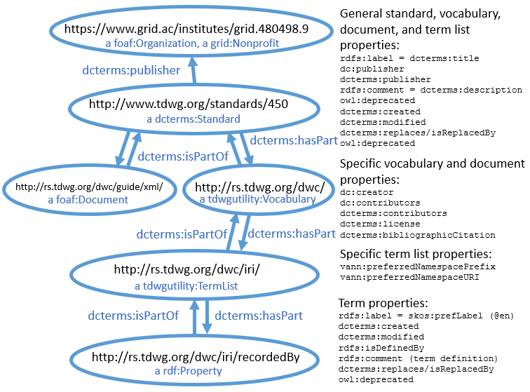
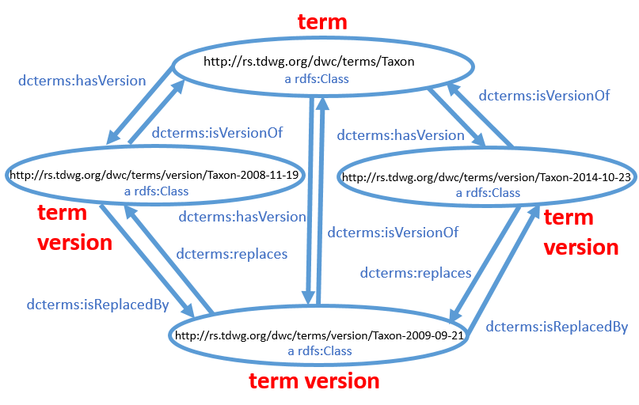
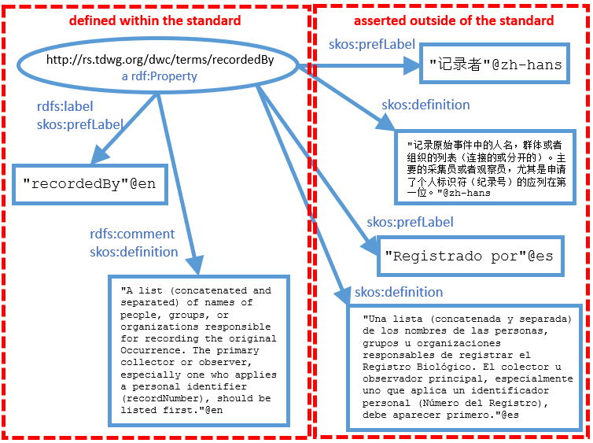

# TDWG standards machine-readable metadata
**Vanderbilt University Semantic Web Working Group SPARQL endpoint**

[back to the User Guide](README.md)

[go to the SPARQL query interface](https://sparql.vanderbilt.edu/#query)

Some of the IRIs in this graph dereference as human-readable text and some may return machine-readable RDF/XML.  Eventually, every URI will dereference in both human- and machine-readable form, but as of 2017-10-24, this has not yet been achieved.

## Status

The [Standards Documentation Specification](https://github.com/tdwg/vocab/blob/master/sds/documentation-specification.md) (SDS) of [Biodiversity Information Standards](http://www.tdwg.org/) (TDWG) describes how metadata related to TDWG standards should be described in machine-readable form.  The data in this graph include all current available metadata about TDWG standards.  The properties of resources in this graph should be considered relatively stable, given that they are generally specified by the SDS.  This is particularly true for metadata about vocabularies, term lists, and terms.  Properties of documents is still under development as of 2017-10-24 and most documents are not yet described fully.

## Named graphs in the triple store

### TDWG standards metadata graph http://rs.tdwg.org/

There are about 22 000 triples in the graph.  It includes metadata about present and past standards of TDWG, including those that are deprecated.  It does not include pre-standard vocabularies or ancillary metada (described below).

The raw metadata used to generate the graph is located at https://github.com/tdwg/rs.tdwg.org.  A general description of the metadata model and patterns used for IRIs that identify resources are described in [that repo's README](https://github.com/tdwg/rs.tdwg.org/blob/master/README.md).

The following raw metadata sources are used to generate this graph:
- ac-borrowed
- audubon
- audubon-versions
- dc-for-dwc
- dc-for-dwc-versions
- dcterms-for-dwc
- dcterms-for-dwc-versions
- dwctype
- dwctype-versions
- iri
- iri-versions
- standards
- standards-versions
- term-lists
- term-lists-versions
- terms
- terms-versions
- vocabularies
- vocabularies-versions

**Graph model:**



The basic graph model for TDWG standards components is hierarchical.  Each resource is related to resources higher in the hierarchy by dcterms:isPartOf and to resources lower in the hierarchy by dcterms:hasPart.



Each resource has one or more versions that capture the state of that resource at a particular moment in time. Versions generally have the same properties of the resources that they are versions of, except that they have dcterms:issued dates rather than dcterms:created and dcterms:modified dates.  Versions are related to later versions by dcterms:isReplacedBy and to earlier versions by dcterms:replaces.  

The Standards Documentation Specification also differentiates between components as abstract entities and their concrete representations, which may be in various formats or serializations.  However, this has not yet been implemented in the dataset.

**CURIEs (namespaces) used:**
```
PREFIX rdf: <http://www.w3.org/1999/02/22-rdf-syntax-ns#>
PREFIX rdfs: <http://www.w3.org/2000/01/rdf-schema#>
PREFIX owl: <http://www.w3.org/2002/07/owl#>
PREFIX xsd: <http://www.w3.org/2001/XMLSchema#>
PREFIX skos: <http://www.w3.org/2004/02/skos/core#>
PREFIX dc: <http://purl.org/dc/elements/1.1/>
PREFIX dcterms: <http://purl.org/dc/terms/>
PREFIX vann: <http://purl.org/vocab/vann/>
PREFIX tdwgutility: <http://rs.tdwg.org/dwc/terms/attributes/>
```

### Obsolete metadata graph http://tdwg.org/obsolete

There are about 7000 triples in the graph.  This graph includes metadata about resources that were never part of any standard, but that might be of historical interest.  For example, pre-standard versions of Darwin Core are included here.  The structure and properties of these metadata are generally the same as described for the http://rs.tdwg.org/ graph.

The following raw metadata sources from https://github.com/tdwg/rs.tdwg.org are used to generate this graph:
- curatorial
- curatorial-versions
- dwc-obsolete
- dwc-obsolete-versions
- dwcore
- dwcore-versions
- geospatial
- geospatial-versions

### Ancillary metadata graph http://tdwg.org/ancillary

There are about 2700 triples in the graph.  In order to segregate metadata about resources that are part of TDWG standards from ancillary metadata that make assertions about those resources but are NOT part of any standard, the ancillary metadata is included in a separate graph.

The following raw metadata sources from https://github.com/tdwg/rs.tdwg.org are used to generate this graph:
- decisions
- dwc-translations
- utility
- utility-versions



For example, the standards documentation specification recommends that each vocabulary term have a label that is an English language-tagged literal value of rdfs:label and a definition that is an English language-tagged value of rdfs:comment.  Labels and definitions may be provided in other languages, but to simplify their management, those non-English metadata should be asserted outside of the standard itself.  The English and non-English metadata can be combined by merging the TDWG standards metadata graph and the ancillary metadata graph (e.g. by using two FROM clauses in a SPARQL query).

Both English and non-English preferred labels can be values of skos:prefLabel, and both English and non-English definitions can be values of skos:definition.  The SKOS specification requires that there be no more than one skos:prefLabel value for each language tag.


## Sample queries:

List currently recommended class terms in the basic Darwin Core vocabulary.  The default graph is defined to include only the named graph http://rs.tdwg.org/ to prevent possible matches with other metadata in the triplestore that is irrelevant.  Note that the SPARQL property path * modifier was used to allow any number of isPartOf links.
```
PREFIX rdfs: <http://www.w3.org/2000/01/rdf-schema#>
PREFIX owl: <http://www.w3.org/2002/07/owl#>
PREFIX skos: <http://www.w3.org/2004/02/skos/core#>
PREFIX dcterms: <http://purl.org/dc/terms/>

SELECT DISTINCT ?term ?label ?def
FROM <http://rs.tdwg.org/>
WHERE {
  ?term dcterms:isPartOf* <http://rs.tdwg.org/dwc/>.
  ?term a rdfs:Class.
  MINUS {?term owl:deprecated "true"^^xsd:boolean.}
  ?term rdfs:label ?label.
  ?term rdfs:comment ?def.
}
ORDER BY ASC(?label)
```

List the currently recommended terms in the core Darwin Core term list and give their label and definition in Spanish.  Notice that the ancillary metadata graph (http://tdwg.org/ancillary) must be included in the default graph with the standards metadata graph (http://rs.tdwg.org/) in order to make the translations available.  To retrieve labels and definitions in simplified Chinese characters, replace 'es' with'zh-hans'.  
```
PREFIX rdfs: <http://www.w3.org/2000/01/rdf-schema#>
PREFIX owl: <http://www.w3.org/2002/07/owl#>
PREFIX skos: <http://www.w3.org/2004/02/skos/core#>

SELECT DISTINCT ?term ?label ?def
FROM <http://rs.tdwg.org/>
FROM <http://tdwg.org/ancillary>
WHERE {
  ?term rdfs:isDefinedBy <http://rs.tdwg.org/dwc/terms/>.
  MINUS {?term owl:deprecated "true"^^xsd:boolean.}
  ?term skos:prefLabel ?label.
  ?term skos:definition ?def.
  FILTER (lang(?label)='es')
  FILTER (lang(?def)='es')
}
ORDER BY ASC(?term)
```

## Using the SPARQL endpoint as an API

### Format of the GET URI

Using an HTTP GET request, a limitless variety of data can be retrieved by sending the appropriate SPARQL query to the endpoint.  If the request header ```Accept: application/sparql-results+json``` is sent with the request, the results will be returned as JSON.  (For our endpoint, without an Accept header, the default format is XML.)  The endpoint URI is https://sparql.vanderbilt.edu/sparql .  The query is sent as a query string with the key "query" and value as the URL-encoded query string; for example:

```
query=PREFIX%20rdf%3A%20%3Chttp%3A%2F ...
```
The overall GET URL looks like this:
```
https://sparql.vanderbilt.edu/sparql?query=PREFIX%20rdf%3A%20%3Chttp%3A%2F ...
```

# Beyond this point is under construction and contains irrelevant information that is being used as a template.


### Example query to retrieve all known "dirty" string values for all terms.

If you have built an application to do data cleaning on "dirty" string values for dwc:occurrenceStatus, you might want to periodically update your application with the most recent and comprehensive list of known string values and the controlled value terms with which they are associated.  The following query will retrieve pairs of term URIs and known values:

```
PREFIX skos: <http://www.w3.org/2004/02/skos/core#>
SELECT DISTINCT ?term ?value where {
?term <http://www.w3.org/2000/01/rdf-schema#isDefinedBy> <http://rs.tdwg.org/cv/status/>.
{?term skos:prefLabel ?langLabel.FILTER (str(?langLabel) = ?value)}
UNION
{?term skos:hiddenLabel ?value. }
UNION
{?term <http://www.w3.org/1999/02/22-rdf-syntax-ns#value> ?value. }
}
```

You can test this query by pasting it into the box at https://sparql.vanderbilt.edu .

### API call to retrieve all known "dirty" string values for all terms

Using a [URL Encoder](https://meyerweb.com/eric/tools/dencoder/) to encode the query, here is the GET URI necessary to retrieve the data:
```
https://sparql.vanderbilt.edu/sparql?query=PREFIX%20skos%3A%20%3Chttp%3A%2F%2Fwww.w3.org%2F2004%2F02%2Fskos%2Fcore%23%3E%0ASELECT%20DISTINCT%20%3Fterm%20%3Fvalue%20where%20%7B%0A%3Fterm%20%3Chttp%3A%2F%2Fwww.w3.org%2F2000%2F01%2Frdf-schema%23isDefinedBy%3E%20%3Chttp%3A%2F%2Frs.tdwg.org%2Fcv%2Fstatus%2F%3E.%0A%7B%3Fterm%20skos%3AprefLabel%20%3FlangLabel.FILTER%20(str(%3FlangLabel)%20%3D%20%3Fvalue)%7D%0AUNION%0A%7B%3Fterm%20skos%3AhiddenLabel%20%3Fvalue.%20%7D%0AUNION%0A%7B%3Fterm%20%3Chttp%3A%2F%2Fwww.w3.org%2F1999%2F02%2F22-rdf-syntax-ns%23value%3E%20%3Fvalue.%20%7D%0A%7D
```

With a header of ```Accept: application/sparql-results+json```, here is what the (truncated) JSON results look like:
```
{
    "head": {
        "vars": [
            "term",
            "value"
        ]
    },
    "results": {
        "bindings": [
            {
                "term": {
                    "type": "uri",
                    "value": "http://rs.tdwg.org/cv/status/extant"
                },
                "value": {
                    "type": "literal",
                    "value": "Raro"
                }
            },
            {
                "term": {
                    "type": "uri",
                    "value": "http://rs.tdwg.org/cv/status/extant"
                },
                "value": {
                    "type": "literal",
                    "value": "Reported"
                }
            },
            {
                "term": {
                    "type": "uri",
                    "value": "http://rs.tdwg.org/cv/status/inappropriate"
                },
                "value": {
                    "type": "literal",
                    "value": "Processed"
                }
            },
            {
                "term": {
                    "type": "uri",
                    "value": "http://rs.tdwg.org/cv/status/inappropriate"
                },
                "value": {
                    "type": "literal",
                    "value": "radan vieressä"
                }
            },
...
            {
                "term": {
                    "type": "uri",
                    "value": "http://rs.tdwg.org/cv/status/uncertain"
                },
                "value": {
                    "type": "literal",
                    "value": "uncertain"
                }
            }
        ]
    }
}
```
If the JSON response body is loaded into a Javascript object called "returnedJson", the term URIs and string values can be referenced as array values by
```
returnedJson.results.bindings[i].term.value
```
and
```
returnedJson.results.bindings[i].value.value
```
respectively.

### API call for the first sample query to retrieve term labels and definitions in Spanish

**GET URI:**
```
https://sparql.vanderbilt.edu/sparql?query=PREFIX%20skos%3A%20%3Chttp%3A%2F%2Fwww.w3.org%2F2004%2F02%2Fskos%2Fcore%23%3E%0ASELECT%20DISTINCT%20%3Fterm%20%3Flabel%20%3Fdef%20WHERE%20%7B%0A%3Fterm%20%3Chttp%3A%2F%2Fwww.w3.org%2F2000%2F01%2Frdf-schema%23isDefinedBy%3E%20%3Chttp%3A%2F%2Frs.tdwg.org%2Fcv%2Fstatus%2F%3E.%0A%3Fterm%20skos%3AprefLabel%20%3Flabel.%0A%3Fterm%20skos%3Adefinition%20%3Fdef.%0AFILTER%20(lang(%3Flabel)%3D%27es%27)%0AFILTER%20(lang(%3Fdef)%3D%27es%27)%0A%7D%0AORDER%20BY%20ASC(%3Flabel)
```
(for a different language, substitute a different language code for the two occurrences of "es" in the query string)


**JSON response:**
```
{
    "head": {
        "vars": [
            "term",
            "label",
            "def"
        ]
    },
    "results": {
        "bindings": [
            {
                "term": {
                    "type": "uri",
                    "value": "http://rs.tdwg.org/cv/status/absent"
                },
                "label": {
                    "xml:lang": "es",
                    "type": "literal",
                    "value": "ausente"
                },
                "def": {
                    "xml:lang": "es",
                    "type": "literal",
                    "value": "No está presente en la localidad"
                }
            },
            {
                "term": {
                    "type": "uri",
                    "value": "http://rs.tdwg.org/cv/status/extant"
                },
                "label": {
                    "xml:lang": "es",
                    "type": "literal",
                    "value": "existente"
                },
                "def": {
                    "xml:lang": "es",
                    "type": "literal",
                    "value": "Se conoce o espera con alta probabilidad que la especie se encuentre en el area, incluyendo localidades con registros recientes (los ultimos  20-30 años) de la presencia de un habitat adecuado a una altitud apropiada"
                }
            },
            {
                "term": {
                    "type": "uri",
                    "value": "http://rs.tdwg.org/cv/status/extinct"
                },
                "label": {
                    "xml:lang": "es",
                    "type": "literal",
                    "value": "extinta"
                },
                "def": {
                    "xml:lang": "es",
                    "type": "literal",
                    "value": "Se sabe de la existencia de la especie en el area en el pasado, o se cree que la especie pudo haber existido en el area, pero se ha confirmado que la especie no se encuentra debido a que luego de búsquedas exhaustivas, no se han producido registros recientes, y la intensidad duracion de amenazas posiblemente hayan extirpado el taxón"
                }
            },
            {
                "term": {
                    "type": "uri",
                    "value": "http://rs.tdwg.org/cv/status/recentlyextinct"
                },
                "label": {
                    "xml:lang": "es",
                    "type": "literal",
                    "value": "extinta post 1500"
                },
                "def": {
                    "xml:lang": "es",
                    "type": "literal",
                    "value": "Se sabe de la existencia de la especie en el area en el pasado, o se cree que la especie pudo haber existido en el area (despues del año 1,500), pero se ha confirmado que la especie no se encuentra debido a que luego de búsquedas exhaustivas, no se han producido registros recientes, y la intensidad duracion de amenazas posiblemente hayan extirpado el taxón"
                }
            },
            {
                "term": {
                    "type": "uri",
                    "value": "http://rs.tdwg.org/cv/status/inappropriate"
                },
                "label": {
                    "xml:lang": "es",
                    "type": "literal",
                    "value": "inadecuado"
                },
                "def": {
                    "xml:lang": "es",
                    "type": "literal",
                    "value": "El registro incluye un valor no adecuado para la propiedad estadoOcurrencia"
                }
            },
            {
                "term": {
                    "type": "uri",
                    "value": "http://rs.tdwg.org/cv/status/pextant"
                },
                "label": {
                    "xml:lang": "es",
                    "type": "literal",
                    "value": "posiblemente existente"
                },
                "def": {
                    "xml:lang": "es",
                    "type": "literal",
                    "value": "No hay registro de la especie en el area, pero es posible que la especie se encuentre allí"
                }
            },
            {
                "term": {
                    "type": "uri",
                    "value": "http://rs.tdwg.org/cv/status/pextinct"
                },
                "label": {
                    "xml:lang": "es",
                    "type": "literal",
                    "value": "possiblemente extinta"
                },
                "def": {
                    "xml:lang": "es",
                    "type": "literal",
                    "value": "Se sabe de la existencia de la especie en el area en el pasado, o se cree que la especie pudo haber existido en el area, pero es muy probable que la especie no se encuentre debido a que luego de búsquedas exhaustivas, no se han producido registros recientes y la intensidad duracion de amenazas posiblemente hayan extirpado el taxón"
                }
            },
            {
                "term": {
                    "type": "uri",
                    "value": "http://rs.tdwg.org/cv/status/uncertain"
                },
                "label": {
                    "xml:lang": "es",
                    "type": "literal",
                    "value": "presencia incierta"
                },
                "def": {
                    "xml:lang": "es",
                    "type": "literal",
                    "value": "La presencia de la especie se ha registrado en el area, pero dicho registro necesita ser verificado o es cuestionable debido a la incertidumbre o autenticidad del registro o la exactitud de la localidad"
                }
            },
            {
                "term": {
                    "type": "uri",
                    "value": "http://rs.tdwg.org/cv/status/null"
                },
                "label": {
                    "xml:lang": "es",
                    "type": "literal",
                    "value": "sin valor"
                },
                "def": {
                    "xml:lang": "es",
                    "type": "literal",
                    "value": "El registro no incluye valor adecuado"
                }
            }
        ]
    }
}
```

**Javascript array references:**

```returnedJson.results.bindings[i].term.value``` for the term URI

```returnedJson.results.bindings[i].label.value``` for the term label

```returnedJson.results.bindings[i].def.value``` for the term definition

## Some additional notes about metadata management

Although the metadata about the controlled vocabulary are accessed by searching RDF triples in the Blazegraph graph database, they will actually be managed as CSV files on Github.  Ultimately, they will probably be maintained on the [TDWG Github site](https://github.com/tdwg), but currently they are at https://github.com/baskaufs/cv.  The data used to generate the "standards" metadata are in [this CSV file](https://github.com/baskaufs/cv/blob/master/occurrenceStatus/occurrenceStatus.csv), the translations metadata are in [this CSV file](https://github.com/baskaufs/cv/blob/master/occurrenceStatusTranslations/occurrenceStatusTranslations.csv), and the mapping of "dirty" string values to controlled vocabulary terms are in [this CSV file](https://github.com/baskaufs/cv/blob/master/occurrenceStatusHiddenLabel/occurrenceStatusHiddenLabel.csv) that was derived from actual data from GBIF.  

The CSV columns are mapped to RDF predicates using the mappings [here](https://github.com/baskaufs/cv/blob/master/occurrenceStatus/occurrenceStatus-column-mappings.csv), [here](https://github.com/baskaufs/cv/blob/master/occurrenceStatusTranslations/occurrenceStatusTranslations-column-mappings.csv), and [here](https://github.com/baskaufs/cv/blob/master/occurrenceStatusHiddenLabel/occurrenceStatusHiddenLabel-column-mappings.csv) by [Guid-O-Matic](https://github.com/baskaufs/guid-o-matic/blob/master/README.md), which is described [here](http://baskauf.blogspot.com/2016/10/guid-o-matic-goes-to-china.html).  The web server version of Guid-O-Matic described [here](http://baskauf.blogspot.com/2017/03/a-web-service-with-content-negotiation.html) has a graph dump URI that was used to load the graphs directly into Blazegraph.  The details aren't important - the point is that changes to the three data sources (the "standard", the translations, and the "dirty" values) are made by updating the corresponding CSVs on Github, not by editing the RDF directly or manipulating the triples directly in the graph database.  This avoids manual editing of anything other than the source CSVs on Github.  A client consuming the machine-readable data from the endpoint will get exactly the labels and definitions entered in the CSV files because the transformations are all automated.


[back to the User Guide](README.md)

[go to the SPARQL query interface](https://sparql.vanderbilt.edu/#query)
