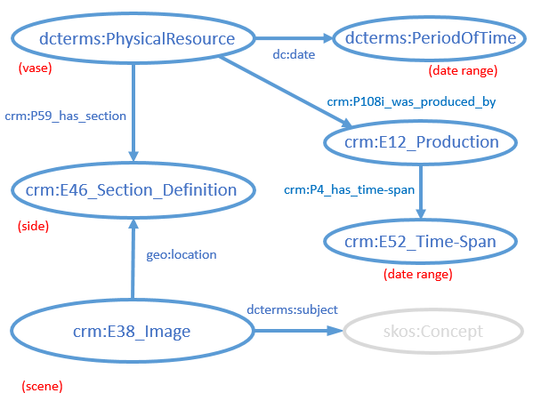
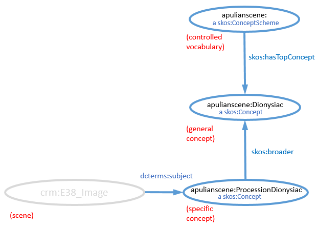

# Ancient Italian Vase graph model
**Vanderbilt University Semantic Web Working Group**

[back to the User Guide](README.md)

[go to the SPARQL query interface](https://sparql.vanderbilt.edu/#query)

Note: None of the URIs of instances described in this graph dereference, nor should those URIs be considered stable.  They have been minted for testing purposes only.

## Status

In the spring of 2017, the Semantic Web WG undertook an exercise to develop a graph model for ancient Italian vases and to apply that model to data compiled by [Veronica Ikeshoji-Orlati](http://researchguides.library.vanderbilt.edu/prf.php?account_id=109576), CLIR Postdoctoral Fellow for Data Curation at the Vanderbilt Jean and Alexander Heard Library.  Given that the ad hoc model was part of an exercise, it should not be considered authoritative or even stable.  Some fairly random notes from the Working Group during the spring semester can be found [here](../vase.md).  

## Named graphs in the triple store (URIs do not dereference)

### Vases graph http://lod.vanderbilt.edu/vase

In developing the model, whenever possible we attempted to find and use classes and properties from the [CIDOC Conceptual Reference Model](http://www.cidoc-crm.org/Version/version-6.2.1) (CIDOC-CRM) that were appropriate.

The model describes the features of ancient vases (in this dataset mostly funerary vases).  The vase itself is typed very generically as a physical resource.  The estimated time of production of the vase was modeled in two ways.  In a simple manner, a dc:date property links to a period of time instance with estimated start and end times described using the [approach taken by the Getty Vocabularies](http://vocab.getty.edu/doc/#Estimated_Dates) (gvp:estStart and gvp:estEnd properties).  We also modeled the estimated date ranges following the example of [Kerameikos.org](http://kerameikos.org/), which uses the more complex CIDOC-CRM model.  In that model, the vase is linked to a production instance and that production instance is linked to a time span instance with estimated beginning and ending dates (crm:P82a_begin_of_the_begin and crm:P82b_end_of_the_end).

In the test dataset, each vase had two sides, which were modeled as defined sections.  (It would be possible to have more than two sections if additional parts of the vase were described.)  The "A" and "B" side designations in the source dataset were arbitrary and URIs for the sides were generated by appending fragment identifiers "#a" and "#b" to the vase URI.  

Each side can be considered to contain one or more scenes, which we modeled as images.  In the existing dataset, there is only a single scene per side, but in the future sides could be subdivided into more than one scene. The existing scenes were assigned UUID identifiers to allow for assignment of future identifiers without creating collisions.  URIs were formed by appending the UUIDs to a base URI.  We could not find a suitable property in the CIDOC-CRM to link the scenes to the sides, so we used the very generic geo:location property.  

Scenes were categorized by linking them to SKOS concepts using dcterms:subject.

**Graph model:**




**CURIEs (namespaces) used:**
```
PREFIX rdf: <http://www.w3.org/1999/02/22-rdf-syntax-ns#>
PREFIX rdfs: <http://www.w3.org/2000/01/rdf-schema#>
PREFIX xsd: <http://www.w3.org/2001/XMLSchema#>
PREFIX dc: <http://purl.org/dc/elements/1.1/>
PREFIX dcterms: <http://purl.org/dc/terms/>
PREFIX foaf: <http://xmlns.com/foaf/0.1/>
PREFIX crm: <http://www.cidoc-crm.org/cidoc-crm/>
PREFIX geo: <http://www.w3.org/2003/01/geo/wgs84_pos#>
PREFIX dwc: <http://rs.tdwg.org/dwc/terms/>
PREFIX gvp: <http://vocab.getty.edu/>
```
**Sample queries:**

Give the Trendall ID and painter (if known) for vases whose estimated production date is included within the range of -450 to -400 CE.
```
PREFIX rdf: <http://www.w3.org/1999/02/22-rdf-syntax-ns#>
PREFIX xsd: <http://www.w3.org/2001/XMLSchema#>
PREFIX dc: <http://purl.org/dc/elements/1.1/>
PREFIX crm: <http://www.cidoc-crm.org/cidoc-crm/>
PREFIX gvp: <http://vocab.getty.edu/>

SELECT DISTINCT ?trendall ?creator WHERE {
  ?vase dc:date ?period.
  OPTIONAL{?vase dc:creator ?creator.}
  ?vase crm:P48_has_preferred_identifier ?trendall.
  ?period gvp:estStart ?start.
  ?period gvp:estEnd ?end.
  FILTER ("-0400"^^xsd:gYear > ?start)
  FILTER ("-0450"^^xsd:gYear < ?end)
  }
```

Give the Trendall ID and descriptions of all scenes on vases that were painted by the Gravina Painter:
```
PREFIX dc: <http://purl.org/dc/elements/1.1/>
PREFIX dcterms: <http://purl.org/dc/terms/>
PREFIX geo: <http://www.w3.org/2003/01/geo/wgs84_pos#>
PREFIX crm: <http://www.cidoc-crm.org/cidoc-crm/>

SELECT DISTINCT ?trendall ?description WHERE {
  ?vase dc:creator "Gravina Painter".
  ?vase crm:P48_has_preferred_identifier ?trendall.
  ?vase crm:P59_has_section ?side.
  ?scene geo:location ?side.
  ?scene dcterms:description ?description.
  }
ORDER BY ?trendall
```

### Scene controlled vocabulary graph http://lod.vanderbilt.edu/apulian/scene

The controlled vocabulary used to describe the subject of scenes is a very simple SKOS concept scheme. The top level (general) concepts include categorical concepts (e.g. adornment, courtship, procession, etc.) and adjectival concepts (e.g. Dionysiac, Eros, nuptual, etc.).  The lower level (specific) concepts are combinations of upper level concepts, such as adornment (Eros) or procession (Dionysiac).  The lower level concepts are linked to the upper level concepts by skos:broader.

A particular scene may be linked directly to either a lower level or upper level concept by dcterms:subject.  A scene may have one to many subjects.

**Graph model:**




**CURIEs (namespaces) used:**
```
PREFIX rdf: <http://www.w3.org/1999/02/22-rdf-syntax-ns#>
PREFIX rdfs: <http://www.w3.org/2000/01/rdf-schema#>
PREFIX xsd: <http://www.w3.org/2001/XMLSchema#>
PREFIX foaf: <http://xmlns.com/foaf/0.1/>
PREFIX dc: <http://purl.org/dc/elements/1.1/>
PREFIX dcterms: <http://purl.org/dc/terms/>
PREFIX skos: <http://www.w3.org/2004/02/skos/core#>
PREFIX apulianscene: <http://lod.vanderbilt.edu/apulian/scene/>
```
**Sample queries:**

List the top-level concepts in the scheme and their definitions:
```
PREFIX skos: <http://www.w3.org/2004/02/skos/core#>
PREFIX apulianscene: <http://lod.vanderbilt.edu/apulian/scene/>

SELECT DISTINCT ?scene ?definition WHERE {
  apulianscene: skos:hasTopConcept ?scene.
  ?scene skos:definition ?definition.
  }
```

List the top-level concepts that are broader than some lower level concept:
```
PREFIX skos: <http://www.w3.org/2004/02/skos/core#>
PREFIX apulianscene: <http://lod.vanderbilt.edu/apulian/scene/>

SELECT DISTINCT ?scene WHERE {
  ?scene skos:inScheme apulianscene:.
  ?narrow skos:broader ?scene.
  }
```

List museums whose collections contain vases with scenes having a battles as a subject. Note that the SPARQL 1.1 property path modifier "\*" must be used with skos:broader to find subjects that are either linked directly to the scene or that are broader than subjects linked to the scene:  
```
PREFIX skos: <http://www.w3.org/2004/02/skos/core#>
PREFIX dcterms: <http://purl.org/dc/terms/>
PREFIX dwc: <http://rs.tdwg.org/dwc/terms/>
PREFIX geo: <http://www.w3.org/2003/01/geo/wgs84_pos#>
PREFIX crm: <http://www.cidoc-crm.org/cidoc-crm/>
PREFIX apulianscene: <http://lod.vanderbilt.edu/apulian/scene/>

SELECT DISTINCT ?museum WHERE {
  ?subject skos:broader* apulianscene:Battle.
  ?scene dcterms:subject ?subject.
  ?scene geo:location ?side.
  ?vase crm:P59_has_section ?side.
  ?vase dwc:collectionCode ?museum.
  }
```


What are top-level subjects of scenes painted by the Varrese Painter?
```
PREFIX skos: <http://www.w3.org/2004/02/skos/core#>
PREFIX dcterms: <http://purl.org/dc/terms/>
PREFIX geo: <http://www.w3.org/2003/01/geo/wgs84_pos#>
PREFIX crm: <http://www.cidoc-crm.org/cidoc-crm/>
PREFIX apulianscene: <http://lod.vanderbilt.edu/apulian/scene/>

SELECT DISTINCT ?subject WHERE {
  ?vase dc:creator "Varrese Painter".
  ?vase crm:P59_has_section ?side.
  ?scene geo:location ?side.
  ?scene dcterms:subject ?linkedSubject.
  ?linkedSubject skos:broader* ?subject.
  apulianscene: skos:hasTopConcept ?subject.
  }
```

[back to the User Guide](README.md)

[go to the SPARQL query interface](https://sparql.vanderbilt.edu/#query)
