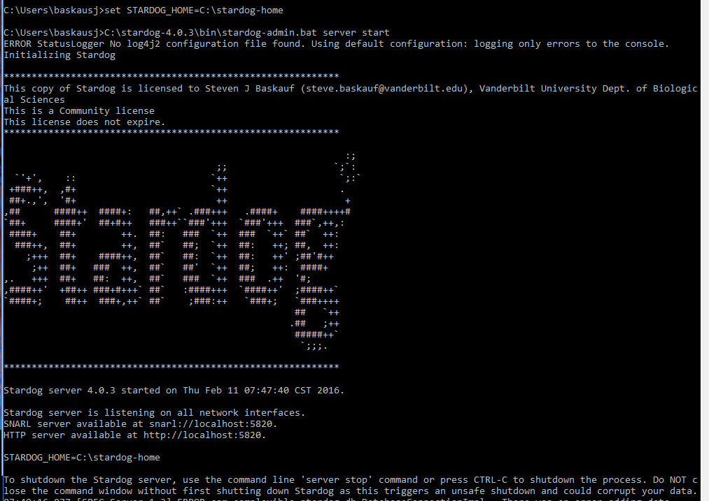

# Stardog Notes


## General Note
The examples are for Windows.  For Mac or Linux, generally drop the ".bat" off of the end of the command.  For example:

```stardog.bat data add myDB schema.ttl```

on Windows would be

```stardog data add myDB schema.ttl```

for Mac.

# Installation (Windows)
Go to http://stardog.com and click Download.  Enter the info and select Stardog Community.  Click download, then check your email.

Use the links in the email to download the .zip archive containing the software.  Unzip it somewhere. In this example I unzipped it to the root of c:, resulting in ```c:\stardog-4.0.3``` as the installation directory.

Note: I chose to unzip it into a directory near the root of the drive so that typing in paths would be easier.

Add ```c:\stardog-4.0.3\bin``` to the PATH environmental variable.  Note:  It is possible to avoid this if you don't mind navigating to the bin directory every time you want to start up the Stardog server.  Alternatively, you can create a batch file and avoid having to do the typing every time.

Set up ```c:\stardog-home``` to be my home directory.  Again, it's your choice, but I made it near the root of the drive to make typing easier.  Eventually Stardog will put some folders and files there to manage the databases you create.

Download the license key (stardog-license-key.bin) and move it to the home directory.

With reference to the directions at
http://docs.stardog.com/
I set the environmental variable STARDOG_HOME in a batch file that I also used to launch the server (as in next section).

Here is what my batch file looked like when I created it in a text editor:

```
set STARDOG_HOME=C:\stardog-home
C:\stardog-4.0.3\bin\stardog-admin.bat server start
```

The first line sets the value of the environmental variable so that Stardog knows the location of the home directory (containing the license file). If you chose a different directory name than "stardog-home", you'll have to modify this command.

The second line invokes the command that starts the server.  Because I specified the entire absolute path, it doesn't really matter if I have included the bin directory in the PATH variable.  If you chose a different place to unzip the files, you'll have to change the name of the directory.

When done, I saved the file as plain text under the name "stardog-start.bat".  I put it in my user home directory since that's where Windows defaults when I open a Command Prompt.  On my computer, that's C:\Users\baskausj

To start the server, I just open a Command Prompt and type "stardog-start.bat".

# Starting the Stardog server (Windows)

If you didn't set up the batch file:

- In the Command Prompt window, Enter the command

```c:\stardog-4.0.2\bin\stardog-admin.bat server start```

if the PATH variable is set correctly, the first part of the path can be omitted.

- The first time you do this, you'll have to allow Java Platform to communicate on the network - at VU I used Domain networks.

Some people were getting Java related errors.  If that happens to you, you may need to download the most recent version of Java JDK.

Here's what it looks like when it works:


- Leave the Command Prompt window open.

# Creating a new database (Windows)
Note: you may not have to do this.  I think you can just do it through the web interface.  We can try it next week.

From the directory where the data.ttl file resides, enter the command

```stardog-admin.bat db create -n myDB data.ttl```

where myDB is the name of the database and data.ttl is the file containing the RDF/Turtle.  The database will be placed in the home folder. Note: if the file isn't found, it will just create the database and you can load the data from the web interface.

# Adding data to a database
From the directory where the Turtle file resides, enter

```stardog.bat data add myDB schema.ttl```

To load the data into a named graph having the URI http://foo, use

```stardog.bat data add -g http://foo myDB schema.ttl```


# Using the Web Console

In the browser, open

```http://localhost:5820/myDB ```

Default username and pwd are both ```admin```

Click the Query tab to get to the SPARQL editor.
